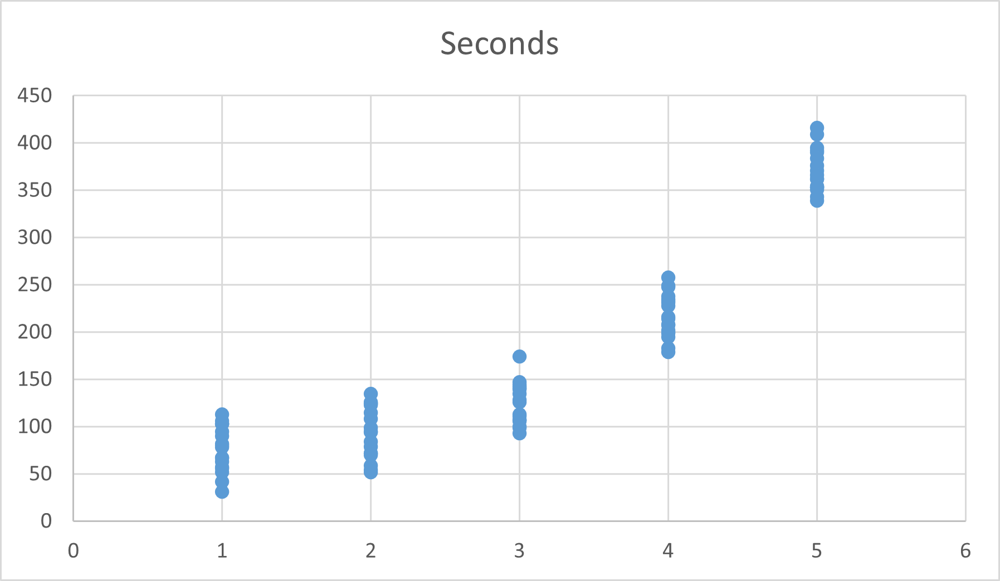

# Configuring the new PEQ

> PEQ: Postgres Enterprise Queue

It is useful to read the base [README](../README.md) and [MESSAGE_LIFECYCLE](/src/MESSAGE_LIFECYCLE.md)

## Where the configuration is

```sql
{schema}.queue_configuration
```

## The Configuration Schema

- setting_name (string) [PK]
  - the setting name
- value (string)
  - The value of the configuration setting
- unit (string)
  - Postgres [INTERVAL](https://neon.com/postgresql/postgresql-tutorial/postgresql-interval) data type AKA
    ```sql
    SET intervalstyle = 'postgres';
    ```
  - Only one interval unit is allowed and only Postgres unit notations are supported:
    ```text
    years, months, days, hours, minutes, seconds
    ```
- casted_as (string)
  - if it gets casted to some other type when used, this field is advisory the code expects the type it expects
  - Do not change this field value as it will have no effect at runtime
  - default: `INTEGER`
- note (text)
  - You can and should change the contents of this column if you change the setting in the `value` column
- modified_on (timestamp w. timezone)
  - Trigger driven
  - Defaults to queue create timestamp

### Warnings

Unless your team customizes the code, making any structural changes to this table, adding, removing, editing key names, etc. is a **BAD** idea.

## What the configuration settings do

AKA the rows in the table `SELECT setting_name, setting_value, unit, casted_as, notes FROM test01. queue_configuration ORDER BY setting_name ASC`

| setting_name                        |     setting_value | unit    | casted_as | notes                                                                                                                                                                                                                                                                                                                                                                                                                                                                                                                                                                                                                                                                                       |
| :---------------------------------- | ----------------: | :------ | :-------- | :------------------------------------------------------------------------------------------------------------------------------------------------------------------------------------------------------------------------------------------------------------------------------------------------------------------------------------------------------------------------------------------------------------------------------------------------------------------------------------------------------------------------------------------------------------------------------------------------------------------------------------------------------------------------------------------ |
| audit_retention                     |                31 | days    | number    | this should be adjusted for your orgs data retention policy.                                                                                                                                                                                                                                                                                                                                                                                                                                                                                                                                                                                                                                |
| backoff_base                        |                10 | seconds | number    | think carefully before changing any of these settings, see Backoff formula                                                                                                                                                                                                                                                                                                                                                                                                                                                                                                                                                                                                                  |
| backoff_factor                      |                 2 | number  | number    | think carefully before changing any of these settings, see Backoff formula                                                                                                                                                                                                                                                                                                                                                                                                                                                                                                                                                                                                                  |
| backoff_jitter_max                  |                99 | number  | number    | think carefully before changing any of these settings, see Backoff formula                                                                                                                                                                                                                                                                                                                                                                                                                                                                                                                                                                                                                  |
| backoff_jitter_min                  |                11 | number  | number    | think carefully before changing any of these settings, see Backoff formula                                                                                                                                                                                                                                                                                                                                                                                                                                                                                                                                                                                                                  |
| cron_schedule_retention_audit_log   |      0 3 \* \* \* | cron    | string    | Schedule to run the audit log cleanup procedure on, 3am Daily                                                                                                                                                                                                                                                                                                                                                                                                                                                                                                                                                                                                                               |
| cron_schedule_retention_dead_letter |      0 3 \* \* \* | cron    | string    | Schedule to run the dead-letter cleanup procedure on, 3am Daily                                                                                                                                                                                                                                                                                                                                                                                                                                                                                                                                                                                                                             |
| cron_schedule_retention_history     |       8 1 \* \* 6 | cron    | string    | Schedule to run history cleanup procedure on, 1:08am Saturday                                                                                                                                                                                                                                                                                                                                                                                                                                                                                                                                                                                                                               |
| cron_schedule_retention_queue       | _/7 _ \* \* \* \* | cron    | string    | Schedule to run the main queue lock clearing procedure on, every 7 minutes                                                                                                                                                                                                                                                                                                                                                                                                                                                                                                                                                                                                                  |
| cron_vacuum                         |     45 4 \* \* \* | cron    | string    | Vaccumm nightly                                                                                                                                                                                                                                                                                                                                                                                                                                                                                                                                                                                                                                                                             |
| dead_letter_retention               |                91 | days    | number    | messages are purged from dead letter after this many days. Remember messages can be requeued using the procedures                                                                                                                                                                                                                                                                                                                                                                                                                                                                                                                                                                           |
| history_retention                   |               181 | days    | number    | this should be adjusted for your orgs data retention policy.                                                                                                                                                                                                                                                                                                                                                                                                                                                                                                                                                                                                                                |
| item_delay                          |                 0 | seconds | number    | delay making message available by this number of seconds, sometimes its useful to have a short initial delay. More often, a jitted value when queuing up batches of messages is useful. For scheduling messages in the future, use the parameters in the procedures                                                                                                                                                                                                                                                                                                                                                                                                                         |
| item_ttl                            |              4320 | minutes | number    | items in the queue live for this # of minutes, before they get moved to dead_letter table, this is a very long time. If anything, consider shortening it.                                                                                                                                                                                                                                                                                                                                                                                                                                                                                                                                   |
| lease_duration                      |                30 | seconds | number    | this is the default lease on an item, if not specified in the call, think hard about this by monitoring the average unit of work, and adjust the setting to be that time plus two standard deviations (rounding up to the nearest second), and remember to consider what should happpen when the system is under stress and adjust the lease time setting as needed either in here or as a parameter to the procedure calls. The art is to balance making sure most units of work that will complete successfully do finish, and those that will not, will not VS. having the unit of work (which represents business value) be overly delayed. The happy path is this value is never used. |
| max_retries                         |                 7 | count   | number    | A message can be processed no more than this many times. Backoff is exponential and jittered, see next settings. Carefully concider if the total maximum elapsed time to process a message and get around to successfully executing its associated unit of work is reasonable.                                                                                                                                                                                                                                                                                                                                                                                                              |

Notes:

1. E.g., is it an optional parameter in the associated procedure(s)

## Backoff formula for retries

This is _pseudocode_, the snake_case is the setting above, the java-case is the computed variable for the message.

```javascript
// The message starts life with ZERO retries, so...
numberOfRetries = numberOfRetries + 1;
// Exponential Backoff
delay = backoff_base * backoff_factor ** numberOfRetries;
// With Jitter
seconds_from_now_message_will_be_available =
  delay + randomBetween(backoff_jitter_min, backoff_jitter_max);
```

### Example Delays



Or from about 1/2 a minute to less than 7 minutes increasing in duration per retry.

### Sidebar: Why Jitter?

It helps avoid collisions in cases where the message processing (consumer) is transitory unavailable. See [YouTube: Queue-Pacing and Overrun Pattern](https://www.youtube.com/watch?v=94aRBEYST7I) for more details.

### Important

Before changing the backoff settings, we strongly suggest using the enclosed [XLSX](./backoff_table.xlsx) to model the impact. Also, consider, if a unit of work can't be completed after 5 tries over approx. 15 minutes, that something else is terriblely wrong.

## Cron

Copied from [pg_cron](https://github.com/citusdata/pg_cron/blob/main/README.md?plain=1)

```
 ┌───────────── min (0 - 59)
 │ ┌────────────── hour (0 - 23)
 │ │ ┌─────────────── day of month (1 - 31) or last day of the month ($)
 │ │ │ ┌──────────────── month (1 - 12)
 │ │ │ │ ┌───────────────── day of week (0 - 6) (0 to 6 are Sunday to
 │ │ │ │ │                  Saturday, or use names; 7 is also Sunday)
 │ │ │ │ │
 │ │ │ │ │
 * * * * *
```

An easy way to create a cron schedule is: [crontab.guru](http://crontab.guru/).

[<---](./README.md)