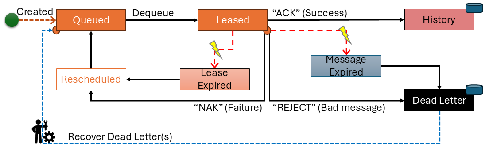

# Message lifecycle

Messages have the following finite state diagram

## Diagram



## Discussion

| State | Pseudo | Discussion |
|:---|:---|:---|
| Queued | no | Indicates a message is ready to be consumed. All messages queued start in this state. |
| Leased | no | Message is "owned" by by a client until the lease expires |
| History | yes | Message has been "ACK" by client, usually this indicates the unit of work has completed successfully. In some cases, it means the message did not need processing. Up to your team how to use ACK. The impact is the message is removed from the queue table after being successfully written to history. |
| Lease-Expired | no | The lease duration has come and gone. Calls to ACK, NAK, or REJECT will error. The client could re-aquire the message in a future call to `dequeue()`, but its not guaranteed. |
| Message-Expired | yes | A message has used up all of its retries, or it total expiration has arrived, see [SCHEMA](./SCHEMA.md) for more details. |
| Dead-Letter | yes | Rejected or expired messages go to dead-letter which removes them from the queue table and inserts them into the dead-letter table. |
| Rescheduled | yes | The actual state is `Lease-Expired` and the system will automatically calculate the new `available_after` timestamp value and increment `retry_count`. Note this is different then an application calling `reschedule(message)` |
| (recovered) | yes | This is logical but not an actual state that happens when one of the `recover()` procedures is invoked to copy a message out of `dead-letter` and put it back in the queue using the arguments passed to the procedure. |

## Paths

Here are some typical paths

### Happy Path

Unit of Work Succeeds (even if it does not need doing)

```text
Queued --> Leased --> (ACK) --> History
```

### Semi-Happy Path

Took a few tries but we made it

```text
Queued --> Leased --> (NAK | Lease-Expired)*n --> [Start Again] --> History
```

### Bad Message Path

Message is mal-formed or has bad data, either way it is unprocessable by the unit-of-work

```text
Queued --> Leased --> (REJECT) --> Dead-Letter
```
## Abandoned Messages (Really unhappy path)

Message never get processed, this is really bad news indeed. This can also happen if message retries are exceeded. 

> Moral: Do not ignore `dead-letter`, in a perfect world, it should have NO rows, if not there is a problem.

```text
Queued --> [nothing happens] --> Event:{Message-Expired} ==> (Message-Expired) --> Dead-Letter
```

-or-


```text
Queued --> [retries exhaused, message marked (Message-Expired)] --> {Message-Expired} --> Dead-Letter
```

## Data Retention Events

System process looks for expired rows and hard deletes them (and calls VACUUM) in both the `history` and `dead-letter` table.

[<--- Start Here](./README.md)