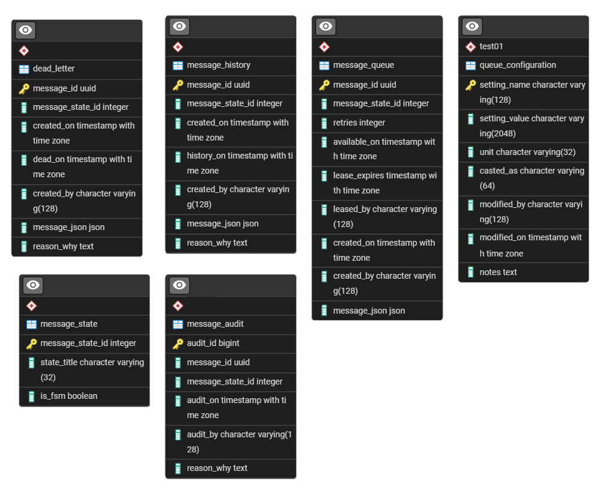

# Enterprise Message Schema

## Schema (the most important thing)

Each queue gets its own schema, delete the schema deletes the queue and all of its history, dead-letters, audit, procedures, functions, etc.

Nice and self contained.

## Role

Role is a future feature and not used


## Tables




## Stored Procedures and Functions

 | "routine_type" | "routine_name" | description |
 |:---|:---|:---|
 | "PROCEDURE" | "add_audit" | add a row to audit table |
 | "FUNCTION" | "calculate_offset" | used to calculate offsets (cron job) | 
 | "PROCEDURE" | "cron_audit_clean" | clean out audit table (cron job) |
 | "PROCEDURE" | "cron_dead_letter_retention" | clean out dead letters (cron job) | 
 | "PROCEDURE" | "cron_history_clean" | clean out history table (cron job) |
 | "PROCEDURE" | "cron_unlock" | unlock stuck messages (cron job) |
 | "FUNCTION" | "dequeue" | fetch a message with a lease |
 | "PROCEDURE" | "enqueue" | send a message to the queue |
 | "PROCEDURE" | "message_ack" | send a message to history (success!) | 
 | "PROCEDURE" | "message_nak" | put message back on queue as available |
 | "PROCEDURE" | "message_rej" | send a message to dead letter |
 | "PROCEDURE" | "post_deploy_test" | post deployment acceptance test | 
 | "FUNCTION" | "random_between" | Handy random number between min and max |
 | "PROCEDURE" | "reset_queue" | Clears all data from queue structures, resets queues |


## Scheduled Jobs

```sql
select jobid, jobname, schedule, command from cron.job;
```

| "jobid" | "jobname" | "schedule" | "command" |
|--:|:---|:---|:---|
| 3 | "retention_queue" | "*/7 * * * * *" | "CALL test01.cron_unlock(0)" |
| 4 | "retention_dead_letter" | "0 3 * * *" | "CALL test01.cron_dead_letter_retention(0)" |
| 5 | "retention_history" | "8 1 * * 6" | "CALL test01.cron_history_clean(0)" |
| 6 | "retention_audit_log" | "0 3 * * *" | "CALL test01.cron_audit_clean(0)" |
| 7 | "nightly-vacuum" | "45 4 * * *" | "VACUUM" |

[<--- Start Here](./README.md)