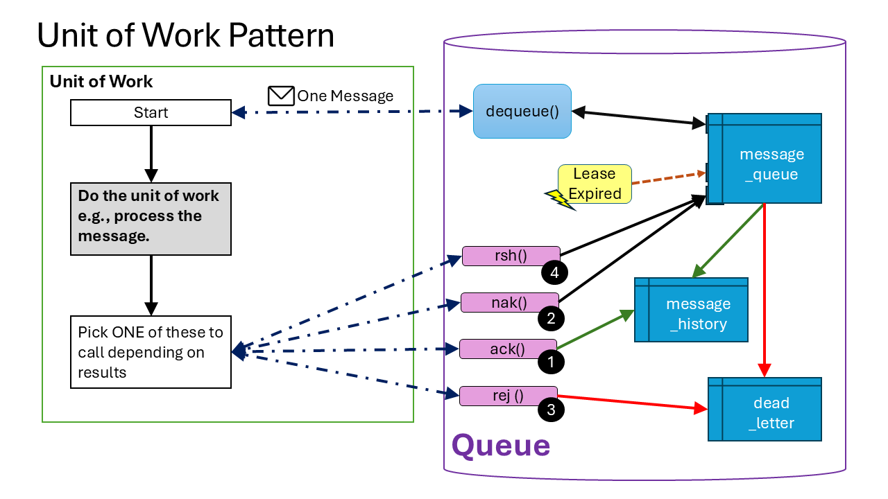

# How to use your queue

- [How to use your queue](#how-to-use-your-queue)
  - [Nice demo](#nice-demo)
  - [What is a unit-of-work?](#what-is-a-unit-of-work)
  - [Enqueue item](#enqueue-item)
  - [Dequeue Items](#dequeue-items)
  - [Unit of Work Observations](#unit-of-work-observations)
    - [ACK (Completed)](#ack-completed)
    - [NAK (Can't complete)](#nak-cant-complete)
    - [REJ (Reject)](#rej-reject)
  - [Rescheduling a message](#rescheduling-a-message)
  - [Tracing what happened to your messages? The Audit](#tracing-what-happened-to-your-messages-the-audit)


## Nice demo

There is nice example of the unit of work pattern and basic queue usage in the SQL file [Post Deployment Test](../data/sql/901_post_deploy_test.sql).

## What is a unit-of-work?

> See [Unit of Work](https://en.wikipedia.org/wiki/Unit_of_work) on Wikipedia

Basically, we enqueue a message to serve as the payload of information for some processing to be done by a consumer, queued up by a producer, that is the smallest amount of processing that is an atomic unit to be processed. 



A UoW has one of these possible outcomes:

* (1) ACK: Happy path, work is done successfully
* (2) NAK: Work could not be done, but is do-able in the future, potentially if given more time
   - Rescheduled (worse case, really need to delay processing)
* (3) REJ: UoW should NOT be done.

> One message => One Unit of Work

## Enqueue item 

Add a new item to the queue

```sql
 call {schema}.enqueue(msg_json [, uuid] [,delay_seconds] [,created_by]);
```

Messages are retained for at least the number of retries in the `queue_configuration` table setting of `max_retries`.

| field         | required | default            | note                                           |
| :------------ | :------: | :----------------- | :--------------------------------------------- |
| message_json  |   yes    | (none)             | valid json                                     |
| message_id    |    no    | uuid_generate_v4() | unique guid                                    |
| delay_seconds |    no    | 0                  | use to delay messages from being processed     |
| created_by    |    no    | 'system'           | who made the message, any valid string will do |

## Dequeue Items

Try and get one message of the queue for the specified lease_duration in seconds.

```sql
DECLARE
    msg_id uuid DEFAULT uuid_generate_v4();
    expires TIMESTAMP;
    msg_json json = '{}';

select b.msg_id, b.expires, b.msg_json
    into msg_id, expires, msg_json
    from test01.dequeue(client_id, lease_duration) as b;
```

This fetches these fields:

- `msg_id`: UUID {GUID} unique id of message
- `expires`: When does the lease expire?
- `msg_json`: The JSON payload of the message

Some notes on the arguments:

- The client_id should be a unique value across all the instances that use this queue

  - Worse case, you can use a GUID (uuid)

- If not supplied, the lease_duration is fetched from `queue_configuration` table setting of `lease_duration`, with a fallback of `30` seconds.

  - If the result is a NAK or the message timed out, consider increasing the lease duration by 50% for each retry

## Unit of Work Observations

The unit of work (UoW) execution must be completed in less time than the `lease_duration` e.g. by the TIMESTAMP returned as `expires` or subsequent calls to ACK, NAK, or REJ will fail as technically, the client does not "own" the work item any more so the system has effectively done an "auto-NAK". This mechanism is baked into the `dequeue()` procedure, but also part of the scheduled cron job [cron_unlock](../data/sql/520_cron_unlock.sql) which matches the 'lease expired' event in the diagram above.

> Again, if the calls to the completion events fail, increase the `lease_duration` AND/OR investigate why the UoW itself is taking so long to process. The default of 30 seconds is a long time to process anything in computer time.

Please see [Message Lifecycle](./MESSAGE_LIFECYCLE.md).

All of them have 3 arguments:

- `msg_id`: the UUID of the message
- `client_id`: of the client
- `reason`: why we called the UOW method, this flows into the `audit`

### ACK (Completed)

The unit of work expressed by the message was completed successfully, the message is moved to history.

> This is the happy path.

```sql
call {schema}.message_ack(msg_id, client_id, 'ack');
```

### NAK (Can't complete)

The unit of work can not be processed successfully, and some other client should process it. This is also what happens if the message times out.

```sql
call {schema}.message_nak(msg_id, client_id, 'uow fail');
```

### REJ (Reject)

The message is bad somehow, and can never be processed, it is moved to DEAD-LETTER.

This what what should happen when:

- Message is malformed
- Has already been processed
- Is no longer relavant
- etc.

For this method in particularly, the `reason_why` should be as detailed as possible for troubleshooting later. The use of an error code or somesuch is a good idea.

```sql
call {schema}.message_rej(msg_id, client_id, reason_why);
```

## Rescheduling a message 

```sql
call {schema}.message_reschedule(msg_id, delay_seconds, [,done_by] [,reason_why])
```

- `msg_id`: the UUID of the message
- `delay_seconds`: (default 3600 [1 hour])
  - Zero: use default
  - Postive: number future
  - Negative:  number past aka immediate delivery
- `done_by`: (default 'system')
- `reason_why`: (default: 'rescheduled')

## Tracing what happened to your messages? The Audit

The audit trail for system end up in the table `message_audit` and are put there because various functions and procedures call the procedure:

```sql
call {schema}.add_audit(
	IN msg_id uuid,
	IN state_id integer,
	IN audit_by character varying,
	IN reason_why text
);
```

* `msg_id`: the key of the message (uuid, guid)
* `state_id`: a valid state (see [message_state](../data/sql/702_message_state_Data.sql) table)
* `audit_by`: caller, typically 'system' or `client_id`
* `reason_why`: (text) a text explaination that is searchable in the source code

So querying the table `message_audit` table 'where' or 'order by' `message_id` is useful.

```sql
SELECT * FROM test01.message_audit
  WHERE cast(message_id as varchar) like '0303%'
  ORDER BY message_id, audit_on ASC LIMIT 100
```

Example output:

 | audit_id | message_id | message_state_id | audit_on | audit_by | reason_why |
 |:---|:---|:---|:---|:---|:---|
 | 21 | 0303596d-ed09-4b82-9cbd-6d36c41eeb6d | 1 | 2025-10-11 05:36:03.667064+00 | system | enqueued | 
 | 91 | 0303596d-ed09-4b82-9cbd-6d36c41eeb6d | 2 | 2025-10-11 05:36:03.711044+00 | client01 | dequeued. lease seconds: 30 | 
 | 92 | 0303596d-ed09-4b82-9cbd-6d36c41eeb6d | 3 | 2025-10-11 05:36:03.711044+00 | client01 | ack | 


[<--- Start Here](./README.md)